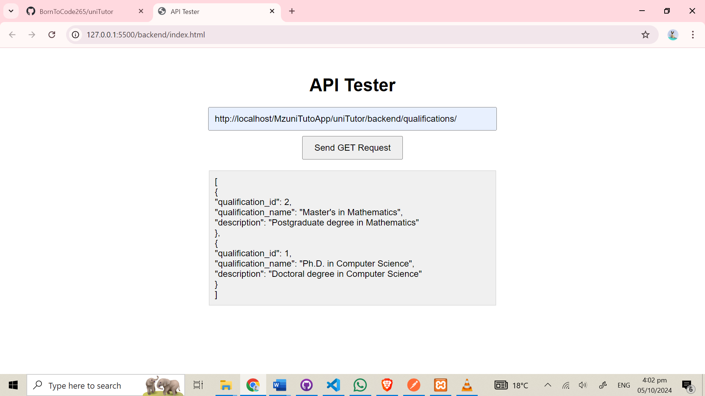
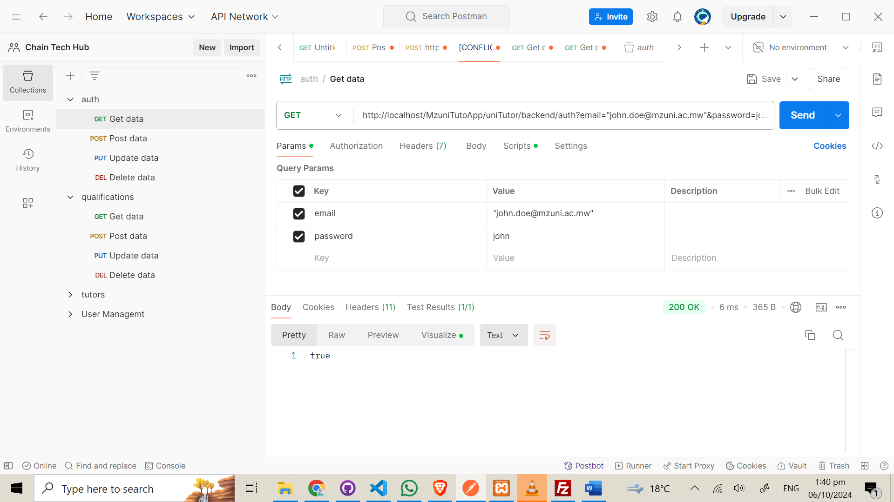
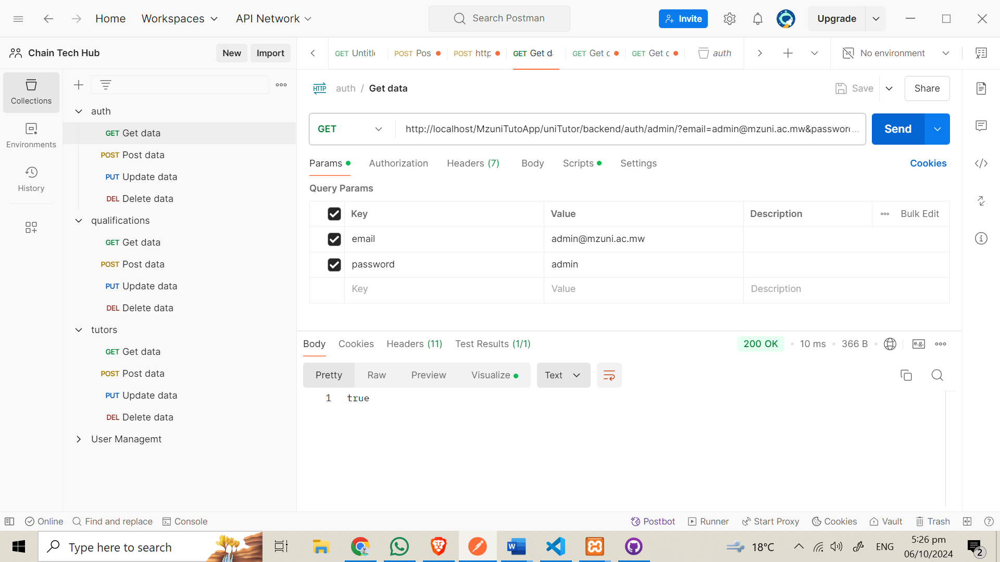

# Credentials

## Student
- Email: john.doe@mzuni.ac.mw
- Password: john

- jane.smith@mzuni.ac.mw
- Pasword : jane

## Admin
- admin@mzuni.ac.mw
- Password : admin

- superadmin@mzuni.ac.mw
- Password : superadmin

## Tutors
- jwilson@mzuni.ac.mw
- Password : tutorjane

- jtaylor@mzuni.ac.mw
- Password : tutorjohn
## Backend Setup

The backend includes API endpoints for CRUD operations. To set up the backend:

1. Download XAMPP
   - [Download XAMPP](https://www.apachefriends.org/download.html)

2. Install XAMPP

3. Clone the repository into the htdocs folder

4. Start the XAMPP control panel

5. Start Apache server and MySQL server
6. import the database mzunitutorapp in the database 

6. Test the setup by opening index.html in your browser

## Testing the API

To ensure the API is working correctly:

1. Open a web browser
2. Navigate to `http://localhost/your-project-name`
3. You should see the API response

### Expected Result

If everything is set up correctly, you should see a JSON response similar to this:
<!--  -->
### get Request

 

### John Doe Authentication

 

### Jane Smith Authentication

 

### Admin Authentication

 